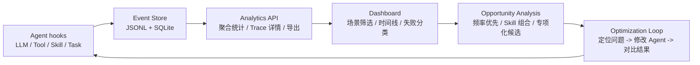

# Hermes Agent 观测看板

一个独立的 Agent Observability 作品集 demo：展示 trace 时间线、工具调用、Skill 使用、失败分类、部门内专项化分析、本地存储和可导出的运行事件。

这个项目是从真实 Hermes Agent 插件中抽出来的独立展示版。Hermes 分支负责说明“如何接入真实 Agent 运行时”，这个仓库负责提供“打开就能看的作品集 demo”。

> 数据说明：仓库内数据均为脱敏模拟样例，不包含真实组织名称、用户信息、内部系统表名、原始周报或生产业务数据。样例只保留企业多部门 Agent 观测与专项化分析的结构和口径。


## 为什么做

Agent 系统经常像黑盒。用户只能看到最终回答，但看不到：

- 调用了哪些工具
- 激活了哪些 Skill
- 延迟耗在哪里
- 任务为什么失败
- 修改 prompt、tool 或 skill 后效果有没有变好
- 部门通用 Agent 内部哪些 Skill 值得细化成全流程专项 Agent

这个项目把 Agent 的运行步骤抽象成结构化事件，并通过本地看板展示出来，形成一个小而完整的分析闭环。除了排查失败，它也用运行数据分析部门通用 Agent 内部哪些 Skill/流程值得进一步细化，产品化成更精细的全流程专项 Agent。这里最核心的口径是调用频率：越高频的 Skill，越值得继续拆细流程、补工具链和做专项化。

## 架构图



## 设计思路

Agent 运行过程天然容易变成黑盒：最终回答只能说明结果，不能说明中间调用了哪个 Tool、触发了哪个 Skill、失败发生在哪一步。

这个项目在 LLM、Tool、Skill 和任务结果 hook 上采集结构化事件，用 `trace_id` 把一次用户请求串成完整链路。事件同时写入 JSONL 和 SQLite：JSONL 方便导出，SQLite 方便本地分析 API 查询。

看板侧提供整体 KPI、场景筛选、trace 时间线、用户请求摘要、任务故事归纳、失败原因分类和优化建议。进一步，每条 trace 会补充部门通用 Agent、业务流程、可细化 Skill、Skill 组合、预计人工耗时和风险等级，用这些数据计算“专项化机会分”。

这里的假设不是“一个通用 Agent 给所有部门用”，而是每个部门都有自己的部门通用 Agent。分析链路先看高频 Skill，因为频率越高说明价值越大；再看这些 Skill 通常和哪些能力组合成流程，判断是否值得细化成全流程专项 Agent。

## 功能

- 本地 JSONL + SQLite 事件存储
- FastAPI 分析接口
- 静态 Dashboard，无需前端构建
- 首次启动自动生成 18 条 trace、百余条事件的样例数据
- 时间范围筛选：1 小时、24 小时、7 天、全部
- 样例场景切换：正常代码修复、权限失败排查、工具超时重试、Skill 触发分析
- Trace 详情时间线
- Trace 顶部展示用户请求摘要
- Trace 阶段归纳和任务故事摘要
- Tool 性能表
- Skill 使用表
- 失败原因分类与优化建议
- 高频 Skill 细化优先级：按调用频率、覆盖流程、成功率和节省时间排序
- 部门内专项 Agent 候选：按部门通用 Agent、Skill、业务流程、成功率、人工节省时间和风险计算机会分
- 网页直接下载 JSON 导出文件

## 快速启动

```bash
python -m venv .venv
source .venv/bin/activate
pip install -e ".[test]"
uvicorn server.main:app --reload --port 9120
```

打开：

```text
http://127.0.0.1:9120
```

应用会自动生成 18 条 trace、百余条事件的样例数据。需要重置样例数据时运行：

```bash
python scripts/generate_sample_data.py
```

## 数据模型

每个运行步骤都会被存成一个事件：

```text
event_id
created_at
trace_id
task_id
session_id
event_type
span_type
name
status
duration_ms
model
provider
payload
```

业务机会分析字段也放在 `payload` 里，方便在不改 schema 的情况下扩展：

```text
department / department_label
department_agent
workflow / workflow_label
candidate_skill
capability_candidate
skill_bundle
agent_candidate
specialized_agent_candidate
estimated_manual_minutes
human_intervention
automation_fit
risk_level
```

所有样例字段均经过泛化处理，例如：

```text
真实组织名 -> A制造集团 / 某制造企业
内部助手名 -> 部门通用 Agent
内部系统表名 -> ERP 接口 / 流程系统 / 数据仓库
精确业务数字 -> 脱敏样例数字或区间化口径
```

代表性事件类型：

```text
llm.requested
llm.completed
tool.completed
skill.used
task.completed
task.failed
task.interrupted
```

## Dashboard API

```text
GET /api/overview?range=24h&scenario=all
GET /api/events?range=24h&scenario=all&limit=30
GET /api/traces/{trace_id}
GET /api/export?range=24h&scenario=all&limit=1000
GET /api/export/download?range=24h&scenario=all&limit=1000
POST /api/demo/reset
```

支持的时间范围是 `1h`、`24h`、`7d`、`all`。
支持的样例场景是 `all`、`code_fix`、`permission`、`timeout`、`skill`。

## 优化闭环

```text
采集运行事件
-> 查看整体健康度
-> 打开失败或慢 trace
-> 定位 tool、skill、prompt 或权限问题
-> 先看高频 Skill 细化优先级
-> 判断部门通用 Agent 内部的专项化候选
-> 修改 Agent 行为
-> 对比下一次运行结果
```

## 真实 Hermes 集成

真实集成分支在这里：

```text
https://github.com/felix-windsor/hermes-agent/tree/agent/local-observability-dashboard
```

那个分支把观测能力接入了 Hermes Agent 的 LLM、Tool、Skill 和任务结果 hook。这个仓库则保留成轻量、清晰、方便面试展示的独立版本。
