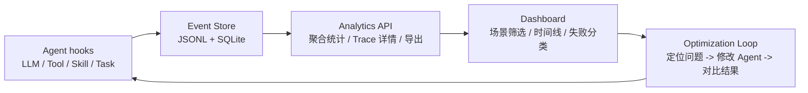

# Hermes Agent 观测看板

一个独立的 Agent Observability 作品集 demo：展示 trace 时间线、工具调用、Skill 使用、失败分类、本地存储和可导出的运行事件。

这个项目是从真实 Hermes Agent 插件中抽出来的独立展示版。Hermes 分支负责说明“如何接入真实 Agent 运行时”，这个仓库负责提供“打开就能看的作品集 demo”。


## 为什么做

Agent 系统经常像黑盒。用户只能看到最终回答，但看不到：

- 调用了哪些工具
- 激活了哪些 Skill
- 延迟耗在哪里
- 任务为什么失败
- 修改 prompt、tool 或 skill 后效果有没有变好

这个项目把 Agent 的运行步骤抽象成结构化事件，并通过本地看板展示出来，形成一个小而完整的分析闭环。

## 架构图



## 功能

- 本地 JSONL + SQLite 事件存储
- FastAPI 分析接口
- 静态 Dashboard，无需前端构建
- 首次启动自动生成样例数据
- 时间范围筛选：1 小时、24 小时、7 天、全部
- 样例场景切换：正常代码修复、权限失败排查、工具超时重试、Skill 触发分析
- Trace 详情时间线
- Trace 顶部展示用户请求摘要
- Tool 性能表
- Skill 使用表
- 失败原因分类
- 网页直接下载 JSON 导出文件

## 快速启动

```bash
python -m venv .venv
source .venv/bin/activate
pip install -e ".[test]"
uvicorn server.main:app --reload --port 9120
```

打开：

```text
http://127.0.0.1:9120
```

应用会自动生成样例 trace。需要重置样例数据时运行：

```bash
python scripts/generate_sample_data.py
```

## 数据模型

每个运行步骤都会被存成一个事件：

```text
event_id
created_at
trace_id
task_id
session_id
event_type
span_type
name
status
duration_ms
model
provider
payload
```

代表性事件类型：

```text
llm.requested
llm.completed
tool.completed
skill.used
task.completed
task.failed
task.interrupted
```

## Dashboard API

```text
GET /api/overview?range=24h&scenario=all
GET /api/events?range=24h&scenario=all&limit=30
GET /api/traces/{trace_id}
GET /api/export?range=24h&scenario=all&limit=1000
GET /api/export/download?range=24h&scenario=all&limit=1000
POST /api/demo/reset
```

支持的时间范围是 `1h`、`24h`、`7d`、`all`。
支持的样例场景是 `all`、`code_fix`、`permission`、`timeout`、`skill`。

## 优化闭环

```text
采集运行事件
-> 查看整体健康度
-> 打开失败或慢 trace
-> 定位 tool、skill、prompt 或权限问题
-> 修改 Agent 行为
-> 对比下一次运行结果
```

## 真实 Hermes 集成

真实集成分支在这里：

```text
https://github.com/felix-windsor/hermes-agent/tree/agent/local-observability-dashboard
```

那个分支把观测能力接入了 Hermes Agent 的 LLM、Tool、Skill 和任务结果 hook。这个仓库则保留成轻量、清晰、方便面试展示的独立版本。
